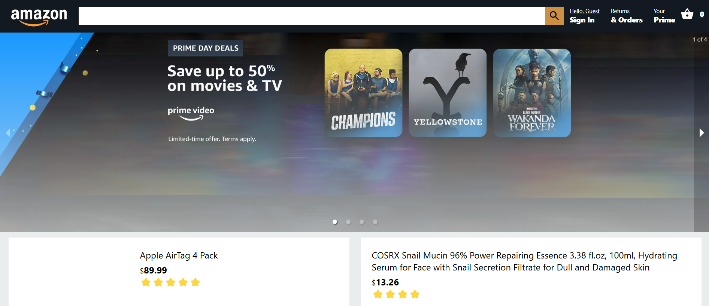
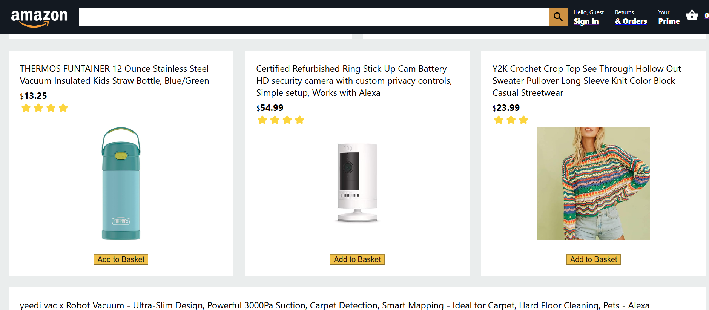
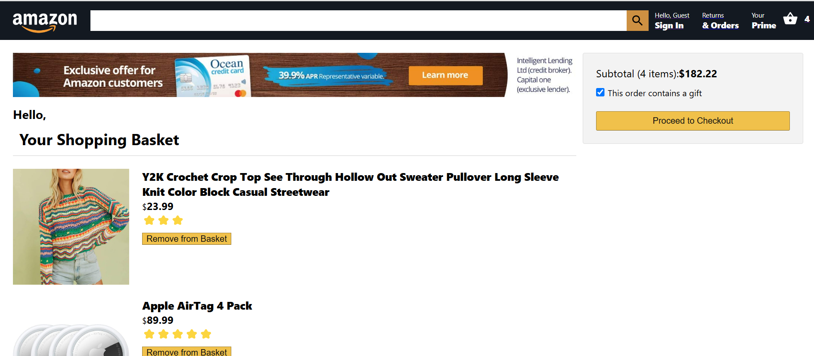

# Full-Stack Amazon Clone

This project is a full-stack Amazon clone developed using **React.js**, **Express.js**, **Firebase**, and **Stripe API**. It offers features such as checkout, payment integration, user authentication, and real-time database functionality. The clone is deployed on Firebase Hosting for easy access and testing. 
## Live Demo
⮕[https://full-stack-clone-b7681.web.app/](https://full-stack-clone-b7681.web.app/)




### Getting Started

To set up a testing account:

- **Option 1:** Create your own account by clicking "Sign Up" and following the on-screen instructions.
- **Option 2:** Use our shared testing account:
  - **Email:** `test@gmail.com`
  - **Password:** `123456`

Thank you for checking out this project! Happy testing!

---

## Technologies Used

- **Frontend**: React.js, React-Dom, React Redux
- **Backend**: Express.js
- **Database & Hosting**: Firebase Authentication, Firebase Storage, Firestore, Firebase Hosting
- **Payment**: Stripe API

---

## Running the Project Locally

Follow these steps to set up and run the project on your local machine:

1. **Clone the repository:**
   ```bash
   git clone <repository-url>
   ```

2. **Install dependencies:**
   ```bash
   cd <repository-folder>
   npm install
   ```

3. **Firebase Configuration:**
   - Create a new project on the [Firebase Console](https://console.firebase.google.com/).
   - Enable Firebase Authentication, Firebase Storage, and Firestore.
   - Add your Firebase configuration object to the `.env` file.

4. **Stripe API Configuration:**
   - Sign up on [Stripe](https://stripe.com/) and obtain your API keys.
   - Add the Stripe API keys to the `.env` file.

5. **Run the Development Server:**
   ```bash
   npm start
   ```
6. **Access the App:** Open your browser and navigate to [http://localhost:3000](http://localhost:3000).

---

## Features

- **Authentication**: Register and login with Firebase Authentication.
- **Product Management**: Add items to the cart, view details, and remove items.
- **Checkout & Payment**: Process secure payments through Stripe API.
- **User-Friendly Interface**: Clean, Amazon-inspired UI.

---

## Acknowledgements

This project was developed as a learning exercise inspired by Amazon